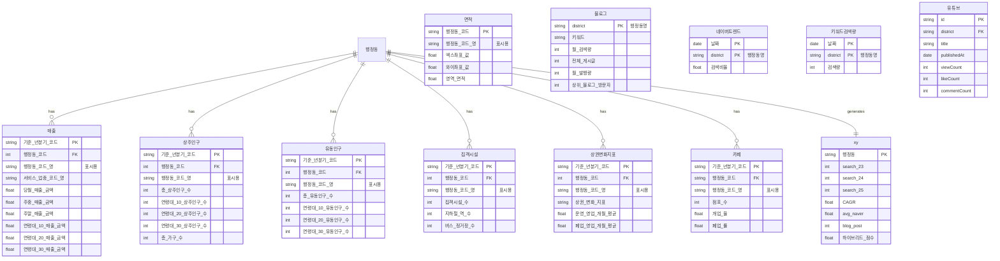

# 📊 DB 스키마

## ERD (Entity Relationship Diagram)

---

## 테이블 상세

### 서울 열린데이터광장 (상권 데이터)

| 테이블           | 파일명           | 주요 컬럼                                      | 설명                           |
| ---------------- | ---------------- | ---------------------------------------------- | ------------------------------ |
| **매출**         | 매출\_[년도].csv | 행정동\_코드, 당월\_매출\_금액, 연령대별\_매출 | 분기별 매출 데이터 (53개 컬럼) |
| **면적**         | 면적.csv         | 행정동\_코드, 영역\_면적, 좌표                 | 행정동 기본 정보               |
| **상권변화지표** | 상권변화지표.csv | 행정동\_코드, 운영\_영업\_개월\_평균           | 상권 활성화 지표               |
| **상주인구**     | 상주인구.csv     | 행정동\_코드, 총\_상주인구\_수, 연령대별       | 거주 인구                      |
| **유동인구**     | 유동인구.csv     | 행정동\_코드, 총\_유동인구\_수, 연령대별       | 방문 인구                      |
| **집객시설**     | 집객시설.csv     | 행정동\_코드, 집객시설\_수, 지하철\_역\_수     | 시설 인프라                    |
| **카페**         | 카페.csv         | 행정동\_코드, 점포\_수, 개업\_율, 폐업\_률     | 카페 업종 현황                 |

### 외부 데이터 (트렌드)

| 테이블           | 파일명                | 주요 컬럼                        | 설명             |
| ---------------- | --------------------- | -------------------------------- | ---------------- |
| **블로그**       | blog.csv              | district, 행정동별 게시글 수     | 판다랭크         |
| **네이버트렌드** | naver_trend.csv       | 날짜, 행정동별 검색비율          | 네이버 데이터랩  |
| **키워드검색량** | keyword_search_3y.csv | 날짜, 행정동별 검색량            | 판다랭크 (3년치) |
| **유튜브**       | youtube_data.csv      | district, viewCount, publishedAt | YouTube API      |

### 분석 결과

| 테이블       | 파일명 | 주요 컬럼                                 | 설명           |
| ------------ | ------ | ----------------------------------------- | -------------- |
| **분석결과** | xy.csv | 행정동, CAGR, avg_naver, 하이브리드\_점수 | 최종 분석 결과 |

---

## 키 관계

| 관계                  | 설명                              |
| --------------------- | --------------------------------- |
| `행정동_코드`         | 서울 열린데이터 테이블 간 조인 키 |
| `기준_년분기_코드`    | 시계열 데이터 조인 키 (예: 20241) |
| `district` / `행정동` | 외부 데이터와 연결 키             |

---

## 데이터 흐름

